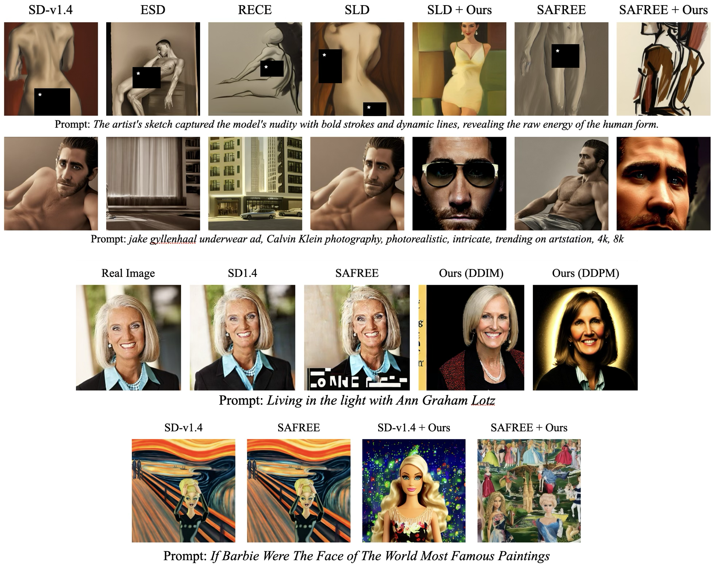

<div align="center">

# Safe Denoiser 

<p align="center">
  <!-- [<a href="https://arxiv.org/pdf/2306.16928.pdf"><strong>Paper</strong></a>] -->
  [<a href="https://arxiv.org/abs/2502.08011"><strong>ArXiv</strong></a>]  
  <!-- [<a href="https://mingyukim87.github.io/SynergyNeRF/"><strong>Project</strong></a>]  -->
  <!-- [<a href="#citation"><strong>BibTeX</strong></a>] -->
</p>

</div>

<!-- <a href="https://arxiv.org/abs/2402.03898"></a>
<a href=#bibtex></a> -->

Official PyTorch implementation of **Safe Denoiser**, as presented in our paper: \
\
**Training-Free Safe Denoisers For Safe Use of Diffusion Models (NeurIPS2025)** \
[Mingyu Kim](https://mingyukim87.github.io/)<sup>*1</sup>, [Dongjun Kim](https://sites.google.com/view/dongjun-kim)<sup>*2</sup>, 
Amman Yusuf<sup>1</sup>, [Stefano Ermon](https://cs.stanford.edu/~ermon/)<sup>2</sup>
and [Mijung Park](https://www.cs.ubc.ca/people/mi-jung-park)<sup>1</sup> \
<sup>1</sup>UBC CS, <sup>2</sup>Stanford CS \
(<sup>\*</sup>: Equally Contributed)

  

## Update
- [x] `Nudity` Task (Ring-A-bell, UnlearnDiffAtk, MMA-Diffusion).
- [x] `Inappropriate Prob.` Task (CoPro).
- [x] Negative Datapoints for {`Nudity`, `Inappropriate Prob.`}.

## News

- (Sep. 2025) Our paper has been accepted in [**NeurIPS 2025**](https://neurips.cc/virtual/2025/loc/san-diego/poster/118136). 


## Environment Setup
```bash
# create conda environment
conda create --name SafeDenoiser python=3.10

# activate env
conda activate SafeDenoiser

# install pytorch >= 2.10 (e.g cu121)
pip install torch==2.1.0+cu121 torchvision==0.16.0+cu121 --extra-index-url https://download.pytorch.org/whl/cu121

# install packages
pip install -r requirements.txt
```

This implementation utilizes the code bases of [SAFREE](https://github.com/jaehong31/SAFREE).

## Checkpoints
For evaluation, this repository uses pretrained checkpoints from the following projects: 
- [NudeNet](https://github.com/notAI-tech/NudeNet)
- [Q16](https://github.com/ml-research/Q16)
- [Improved Aesthetic Predictor (AES)](https://github.com/christophschuhmann/improved-aesthetic-predictor)
  
For convenience, we provide all required checkpoints as a single compressed archive.
- Download: [Google Drive folder](https://drive.google.com/drive/folders/1Ij_4bxRCkIydHhRnEYEt_ZukVM3NwI1L?usp=sharing)

### Download & Extract

Place `pretrained.tar.gz` at the repository root, then run:

```bash
mkdir -p pretrained
tar -xzvf pretrained.tar.gz -C pretrained
```

Expected directory structure:

```text
pretrained/
├── classifier_model.onnx
├── diffusers-nudity-ESDu1-UNET.pt
├── diffusers-nudity-RECE-UNET.pt
├── Q16_prompts_finetuned.pt
├── Q16_prompts_official.p
├── Q16_prompts.p
├── ResNet18_0.945223.pth
├── sac+logos+ava1-l14-linearMSE.pth
└── vehicle_yolov5_best.pt
```

## Dataset
For static NeRFs, this implementation utilizes [NeRF Synthetic](https://drive.google.com/drive/folders/128yBriW1IG_3NJ5Rp7APSTZsJqdJdfc1) and [TankandTemples](https://dl.fbaipublicfiles.com/nsvf/dataset/TanksAndTemple.zip). 
```bash
# NeRF Synthetic: download and extract nerf_synthetic.zip
cd SynergyNeRF_3D
mkdir data
cd data
unzip nerf_synthetic.zip 

# tankandtemples: download and extract TankAndTemple.zip
unzip TankAndTemple.zip 
```
For dynamic NeRFs, this implementation utilizes [D-NeRF Dataset](https://www.dropbox.com/s/0bf6fl0ye2vz3vr/data.zip?e=1&dl=0). 
```bash
# D-NeRF dataset: download and extract data.zip
cd SynergyNeRF_4D
mkdir data
cd data
unzip data.zip 
```


## Quick Start
We provide training scripts based on config files.  
First, we illustrate training static NeRFs for nerf_synthetic and tankandtemples.  
To run this code on GPUs with 24GB of VRAM, you should use the configuration files located in `config/SynergyNeRF/revised_cfg/`.  
If you want to run the code as described in the original paper,  
please use the configuration files found in `config/SynergyNeRF_disentangled/official/`.  
```bash
# training nerf_synthetic
cd SynergyNeRF_3D 
# scenes : {chair, drums, ficus, lego, hotdog, materials, mic, ship}
python main.py --config=config/SynergyNeRF/revised_cfg/8_views/{scene}.yaml

# training tankandtemples
# scenes : {barn, caterpillar, family, truck}
python main.py --config=config/SynergyNeRF/tankandtemples_cfgs/{scene}.yaml
```
Second, we illustrate training dynamic NeRFs for the D-NeRF dataset.
```bash
# training nerf_synthetic
cd SynergyNeRF_4D 
# scenes : {bouncingballs, hellwarrior, hook, jumpingjacks, lego, mutant, standup, trex}
python main.py --config=config/SynergyNeRF/official/{scene}.yaml
```

## Bibliography
```bibtext
@inproceedings{
kim2025trainingfree,
title={Training-Free Safe Denoisers for Safe Use of Diffusion Models},
author={Mingyu Kim and Dongjun Kim and Amman Yusuf and Stefano Ermon and Mijung Park},
booktitle={The Thirty-ninth Annual Conference on Neural Information Processing Systems},
year={2025},
url={https://openreview.net/forum?id=QQS7TudonJ}
}
```

## Acknowledgement
This work was supported by Institute of Information & communications Technology Planning & Evaluation (IITP) grant funded by the Korea government(MSIT) [No.2022-0-00641, XVoice: Multi-Modal Voice Meta Learning]. 
A portion of this work was carried out during an internship at <a href="https://naver-career.gitbook.io/en/teams/clova-cic/ai-lab" target="_blank">NAVER AI Lab</a>.
We also extend our gratitude to <a href="https://actnova.io" target="_blank">ACTNOVA</a> for providing the computational resources required.
